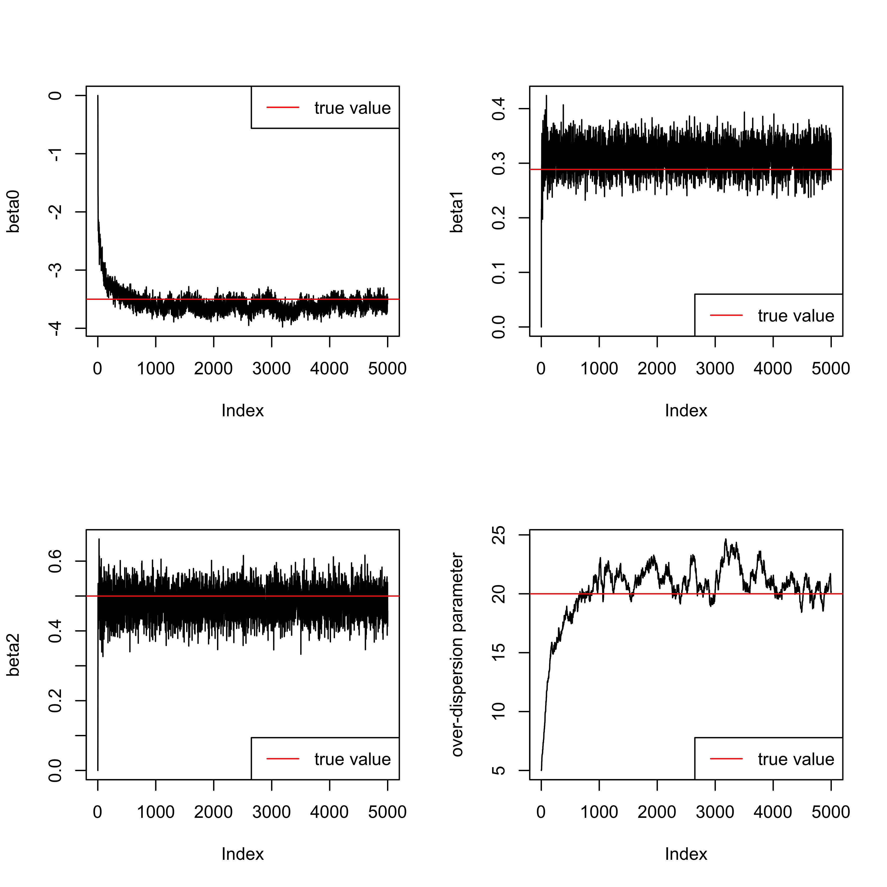
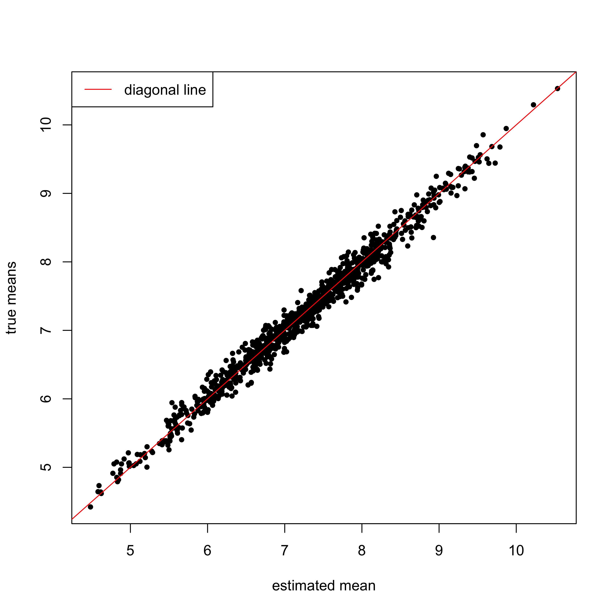
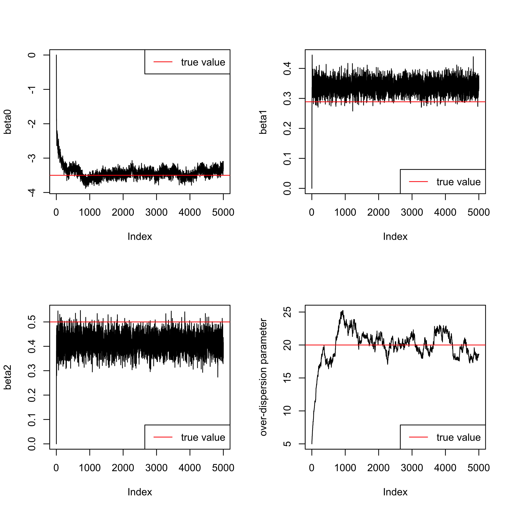
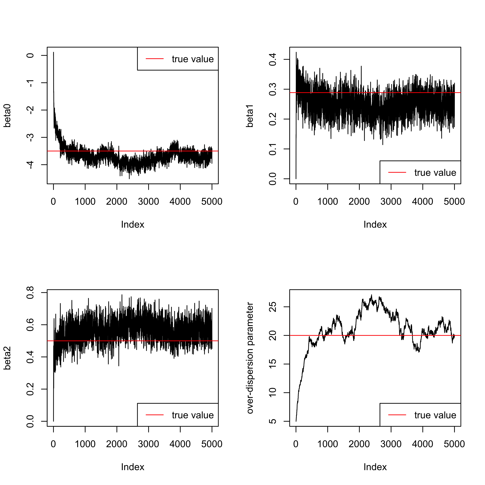

README
================

We have proposed a negative-binomial modeling framework which uses
exposure quantile functions as the function covaraite to account for
within-unit exposure heterogeneity for studying short-term effects of
environmental exposures using exposure and health data collected across
time and/or space. This proposed approch has been implemented in an R
package `nbRegQF`.

In this document, we first introduce how to install the package. Then,
we aim to demonstrate: (1) the use of the function
`fit.health.knownquan` to fit negative-binomial (NB) regression models
using known exposure quantile functions as the covariate to estimate
short-term effects of environmental exposures in a time-series design,
(2) the use of function `fit.exposure` to estimate exposure quantile
functions using previously proposed semiparametric Bayesian approaches
based on individual-level exposures, (3) the use of `exposure.prior` to
prepare means and precision matrices of multivariate normal (MVN) priors
assumed for basis coefficients of basis functions used for expanding
exposure quantile functions, those means and matrices will be used as
inputs for the function `fit.health.quan.errors`, and (4) the use of
`fit.health.quan.errors` to fit NB regression models using estimated
exposure quantile functions while accounting for uncertainties
associated with estimating quantile functions.

# Installation

``` r
install.packages("devtools")
library(devtools)
install_github("YZHA-yuzi/nbRegQF")
```

# Fit negative-binomial regression treating known/estimated exposure quantile functions as the covariate

## The health model

The proposed NB regression models using exposure quantile functions as
the functional covariate is given below

![
\\begin{align\*}
&Y_i \\sim NB(\\eta_i, \\xi) , \\; \\; \\; E\[Y_i\] = \\xi \\exp(\\eta_i), \\\\
&\\eta_i = \\int_0^1 \\beta(\\tau) Q_i(\\tau) + \\boldsymbol{\\gamma}^T\\boldsymbol{Z}\_i + \\epsilon_i,
\\end{align\*}
](https://latex.codecogs.com/png.latex?%0A%5Cbegin%7Balign%2A%7D%0A%26Y_i%20%5Csim%20NB%28%5Ceta_i%2C%20%5Cxi%29%20%2C%20%5C%3B%20%5C%3B%20%5C%3B%20E%5BY_i%5D%20%3D%20%5Cxi%20%5Cexp%28%5Ceta_i%29%2C%20%5C%5C%0A%26%5Ceta_i%20%3D%20%5Cint_0%5E1%20%5Cbeta%28%5Ctau%29%20Q_i%28%5Ctau%29%20%2B%20%5Cboldsymbol%7B%5Cgamma%7D%5ET%5Cboldsymbol%7BZ%7D_i%20%2B%20%5Cepsilon_i%2C%0A%5Cend%7Balign%2A%7D%0A "
\begin{align*}
&Y_i \sim NB(\eta_i, \xi) , \; \; \; E[Y_i] = \xi \exp(\eta_i), \\
&\eta_i = \int_0^1 \beta(\tau) Q_i(\tau) + \boldsymbol{\gamma}^T\boldsymbol{Z}_i + \epsilon_i,
\end{align*}
")

where  denotes
aggregated counts (i.e., the number deaths) observed at the time point
,
")
is the exposure quantile function of a continuous exposure at the time
point ,

is a vector of other covariates,

represents a mean-zero residual process, and
 is the
over-dispersion parameter.

## Example 1: Exposure quantile functions are independent across time points

### Simulate data

Let us simulate individual-level exposures and aggregate health outcomes
assuming data are collected over 1000 time points.

We begin with simulating individual-level exposures assuming
time-specific quantile functions are independent.

``` r
## the number of time points
num.time = 1000
## the number of individuals within each time point
num.size.time = 100
## simulate time-specific means and SDs of exposure distributions
mean.vec = rnorm(num.time, mean = 7.2, sd = 1)
sd.vec = rnorm(num.time, mean = 1, sd = 0.2)
## simulate individual-level exposures
x.sim.mat <- do.call(rbind, lapply(1:num.time, function(x) 
                                     rnorm(num.size.time, 
                                           mean.vec[x], sd.vec[x])))
```

We then generate aggregate health outcomes by assuming
 Q_i(\tau)")
and
 = \tau").

``` r
## specify the beta(tau) 
betatau.true <- function(x) {x}
## simulate aggregate health outcomes 
integral <- function(x, betatau.fun, mean, sd){
  re = betatau.fun(x)*qnorm(x, mean = mean, sd = sd)
  return(re)
}
integration.vec <- do.call(rbind,
                           lapply(1:num.time,
                                  function(y)
                                    integrate(integral, lower = 0, upper = 1,
                                              betatau.fun = betatau.true,
                                              mean = mean.vec[y],
                                              sd = sd.vec[y])$value))

## intercept in the health model
beta0 = -3.5
## the over-dispersion parameter 
xi = 20 
eta.vec.true = beta0 + integration.vec
q.nb = 1/(1+exp(eta.vec.true))
y.vec <- apply(cbind(rep(xi, num.time), q.nb), 1,
               function(x) rnbinom(1, size = x[1], prob = x[2]))
```

### Fit the health model assuming exposure quantile functions are known

The
")
is modeled via the basis expansion. Specifically,
")
is expanded using orthonormal Bernstein polynomials of degree
, in this example we set
. To
approximate
 = \tau")
using orthonormal Bernstein polynomials of degree
, true values of basis
coefficients are
").

Use the function `get_beta_bernstein` in the package `nbRegQF` to
compute true values of basis coefficients in the basis expansion applied
for modeling
 = \tau").

``` r
beta.true <- c(beta0,
               sapply(0:1, 
                      function(x) 
                        get_beta_bernstein(x, n = 1, f = function(y){y})))
```

Use the function `fit.health.knownquan` to fit the NB model assuming
exposure quantile functions are known.

``` r
re.fit.knownquan <- fit.health.knownquan(y = y.vec,
                                         Z.design = NULL,
                                         n = 1, dist.type = "normal",
                                         mean = mean.vec, sd = sd.vec,
                                         rand.int = FALSE,
                                         niter = 5000, burn_in = 2500)
```

Check trace plots of the intercept, basis coefficients, and the
over-dispersion parameter.

``` r
beta.post.knownquan <- re.fit.knownquan$beta
par(mfrow = c(2, 2))
for(i in 1:3){
  plot(beta.post.knownquan[,i], type = "l", ylab = paste0("beta", i-1))
  abline(h = beta.true[i], col = "red")
  if(i == 1){
    legend("topright", col = "red", lty = 1, legend = "true value")
  }else{
    legend("bottomright", col = "red", lty = 1, legend = "true value")
  }
}
plot(re.fit.knownquan$parm[,"xi"], type = "l", ylab = "over-dispersion parameter")
abline(h = xi, col = "red")
legend("bottomright", col = "red", lty = 1, legend = "true value")
```



### Estimate quantile functions

The function `fit.exposure` estimates exposure quantile functions based
on individual-level exposure data using semiparametric Bayesian
approaches proposed in Reich (2012). In this example, we apply the
function `fit.exposure` to estimate exposure quantile functions assuming
quantile processes are independent across time points. At each time
point, the exposure quantile function is modeled via the basis expansion
using four piece-wise Gaussian functions.

``` r
re.fit.exp <- NULL
for(i in 1:1000){
  re.fit.exp[[i]] <- fit.exposure(x.ind = x.sim.mat[i, ],
                                  basis.fun = "Gau", 
                                  L = 4, niter = 10000, inde = T)
}
```

Plot estimated means versus true means.


### Fit the health model using estimated exposure quantile functions

With posterior samples of basis coefficients used for expanding exposure
quantile functions, the means and precision matrices of MVN priors
assumed for basis coefficients of basis functions used for expanding
exposure quantile functions can be computed using the function
`exposure.prior`. Outputs from this function will be used as inputs for
the function `fit.health.quan.errors`, which fits the NB model while
accounting for uncertainties associated with the estimation of quantile
functions. Again, as in the case of assuming quantile functions are
known,
")
is expanded using orthonormal Bernstein polynomials of degree 1.

``` r
MVNprior.mu.pre.ind <- exposure.prior(re = re.fit.exp,
                                      burn_in = 5000, inde = T)

re.fit.quan.errors <- fit.health.quan.errors(y = y.vec, 
                                             L = 4, 
                                             basis.fun = "Gau", 
                                             n = 1, 
                                             theta.pri.mu = MVNprior.mu.pre.ind.all$theta.pri.mu, 
                                             theta.pri.pre = MVNprior.mu.pre.ind.all$theta.pri.pre,
                                             rand.int = FALSE,
                                             niter = 5000, burn_in = 2500)
```

Check trace plots of the intercept, basis coefficients, and the
over-dispersion parameter.

``` r
par(mfrow = c(2, 2))
for(i in 1:3){
  plot(re.fit.quan.errors$beta[,i], type = "l", ylab = paste0("beta", i-1))
  abline(h = beta.true[i], col = "red")
  if(i == 1){
    legend("topright", col = "red", lty = 1, legend = "true value")
  }else{
    legend("bottomright", col = "red", lty = 1, legend = "true value")
  }
}
plot(re.fit.quan.errors$parm[,"xi"], 
     type = "l", ylab = "over-dispersion parameter")
abline(h = xi, col = "red")
legend("bottomright", col = "red", lty = 1, legend = "true value")
```



## Example 2: Exposure quantile functions are temporally correlated

### Simulate data

Let us simulate another dataset collected over 1000 time points which
contains individual-level exposures and aggregate health outcomes.

We begin with simulating individual-level exposures assuming
time-specific quantile functions are temporally correlated across time
points by introducing first-order Gaussian Markov random field processes
for unconstrained basis coefficients used for expanding quantile
functions. To simulate individual-level exposures based on quantile
processes having temporal dependency, exposure quantile functions are
specified via the basis expansion. In the basis expansion, we use four
piece-wise Gamma functions.

``` r
## overall parameters for determining exposure quantile functions
alph.bar.true = 7.2
theta.bar.true = c(0.9,0.9,0.9,0.9)

# the number of basis functions used for expanding quantile functions
L = 4

## parameters related to determine temporal dependency
tau12 = 1; rho1 = 0.9
tau22 = 0.02; rho2 = 0.9

# number of time points
num.time = 1000 
# number of observations at each time point
num.size.time = 100  

## specify adjacency matrix 
### 'get.adjacency' is function in the R package 'igraph'
adj.list = as.matrix(cbind(c(1:(num.time-1)), c(2:num.time)))
W.t = get.adjacency(graph.edgelist(adj.list, directed=FALSE))
Dw.t <- Diagonal(x = apply(W.t, 1, sum))
Sigma1 = tau12*solve(Dw.t - rho1*W.t)
Sigma2 = tau22*solve(Dw.t - rho2*W.t)

## generate time-specific basis coefficients
alph.vec.true = rmvnorm(1, mean = rep(alph.bar.true, num.time),
                        sigma = as.matrix(Sigma1))
theta.mat.true = matrix(NA, ncol = num.time, nrow = L)
for(i in 1:L){
  inter.vec = rmvnorm(1, mean = rep(theta.bar.true[i], num.time),
                      sigma = as.matrix(Sigma2))
  theta.mat.true[i, ] <- inter.vec
}
## theta cannot small than 0 
theta.mat.true[theta.mat.true < 0] = 0.01

## specify the range of exposures
x.vec = seq(0, 100, 0.005)
x.sim.mat <- matrix(NA, nrow = num.time, ncol = num.size.time)
for(i in 1:num.time){
  prob.vec = den.fun(x = x.vec, L = L,
                     theta.vec = theta.mat.true[, i],
                     alpha = alph.vec.true[i],
                     basis.fun = "Gamma",
                     shape = shape)
  x.sim = sample(x.vec, num.size.time, prob = prob.vec)
  x.sim.mat[i, ] <- x.sim
}
```

We then generate aggregate health outcomes by assuming
 Q_i(\tau)")
and
 = \tau").

``` r
## a function to compute int beta(tau)Qt(tau)dtau assuming beta(tau) = tau
intergral <- function(x, L, theta.vec, alpha, shape){
  re.beta = x
  re.quan = as.numeric(quan.fun(x, L = L,
                                theta.vec = theta.vec,
                                alpha = alpha,
                                basis.fun = "Gamma",
                                shape = shape))
  re = re.beta*re.quan
  return(re)
}
integration.vec = rep(NA, num.time)
for(i in 1:num.time){
  integration.vec[i] <- integrate(intergral, lower = 0, upper = 1,
                                  L = L, theta.vec = theta.mat.true[,i],
                                  alpha = alph.vec.true[i],
                                  shape = 5)$value
}
## intercept
beta0 = -3.5
## over-dispersion parameter
xi = 20
eta.vec.true <- beta0 + integration.vec
q.nb = 1/(1 + exp(eta.vec.true))
y.vec <- apply(cbind(rep(xi, num.time), q.nb), 1,
               function(x) rnbinom(1, size = x[1], prob = x[2]))

dat.sim.ar1.gamma <- list(alph.vec.true = alph.vec.true,
                          theta.mat.true = theta.mat.true,
                          x.sim.mat = x.sim.mat,
                          y = y.vec)
```

### Estimate temporally correlated quantile functions

**NOTE**: the following code takes about **4** hours to run in a compute
with 2.9 GHz 6-Core Intel Core i9 and 32 Gb memory.

``` r
re.fit.exp.ar1 <- fit.exposure(x.ind = dat.sim.ar1.gamma$x.sim.mat,
                               basis.fun = "Gamma", 
                               L = 4, niter = 10, inde = F)
```

### Fit the health model using estimated temporally correlated quantile functions

As steps outlined previously for fitting the model with estimated
quantile functions which are assumed to be independent, we first obtain
the means and precision matrices of MVN priors assumed for basis
coefficients using the function `exposure.prior` and then fit the health
model using the function `fit.health.quan.errors`.

``` r
MVNprior.mu.pre.ar1 <- exposure.prior(re = re.fit.exp.ar1,
                                      burn_in = 5000, inde = F)

re.fit.ar1.quan.errors <- 
  fit.health.quan.errors(y = dat.all$health2[,1],
                         L = 4, basis.fun = "Gamma", basis.shape = 5,
                         n = 1, 
                         theta.pri.mu = MVNprior.mu.pre.ar1$theta.pri.mu, 
                         theta.pri.pre = MVNprior.mu.pre.ar1$theta.pri.pre,
                         rand.int = FALSE, niter = 5000, burn_in = 2500)
```

Check trace plots of the intercept, basis coefficients, and the
over-dispersion parameter.


## References:

Reich, B. J. (2012). Spatiotemporal quantile regression for detecting
distributional changes in environmental processes. *Journal of the Royal
Statistical Society: Series C (Applied Statistics), 61(4)*, 535-553.
